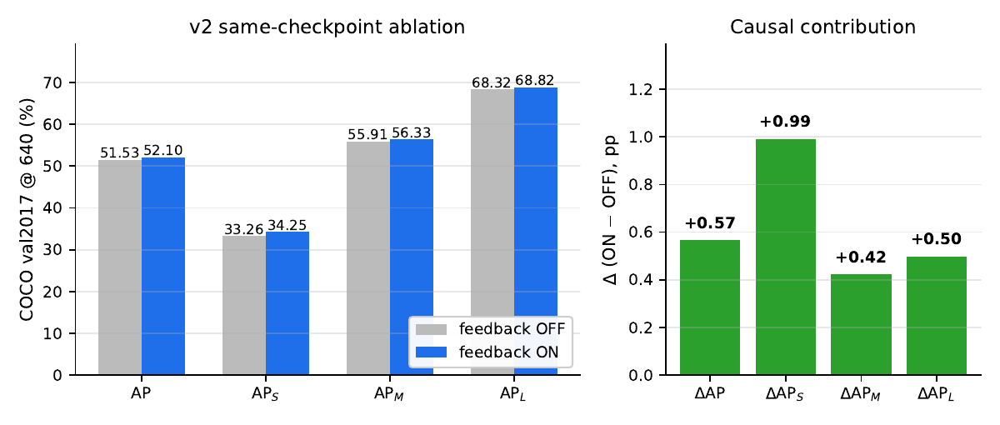
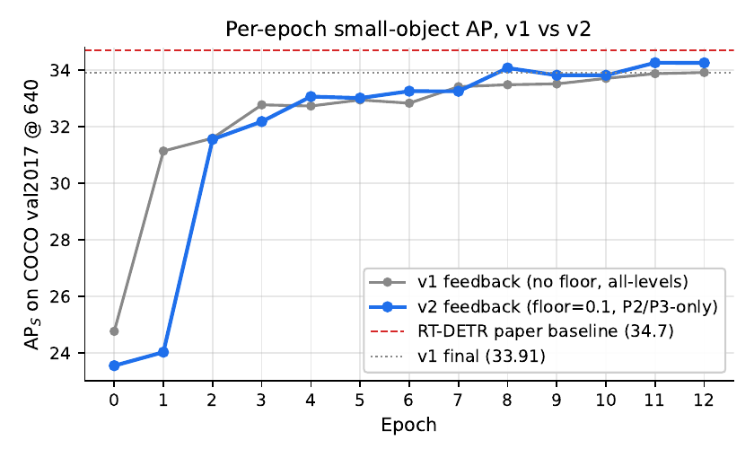
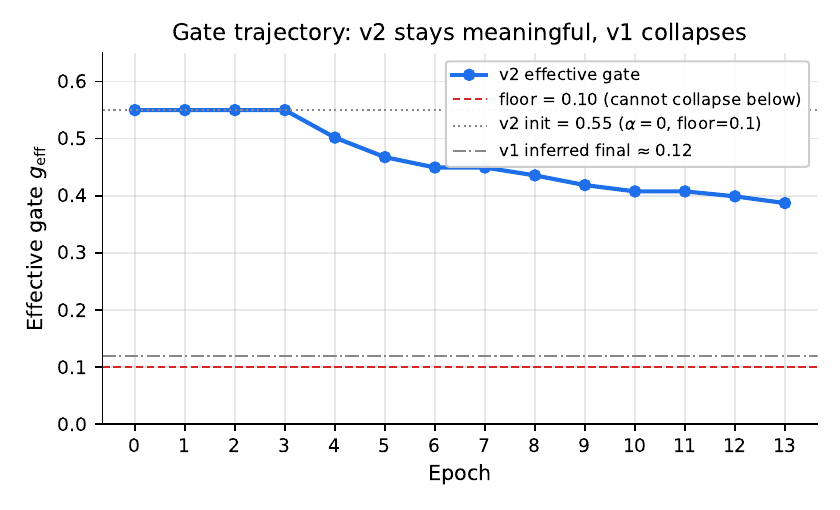
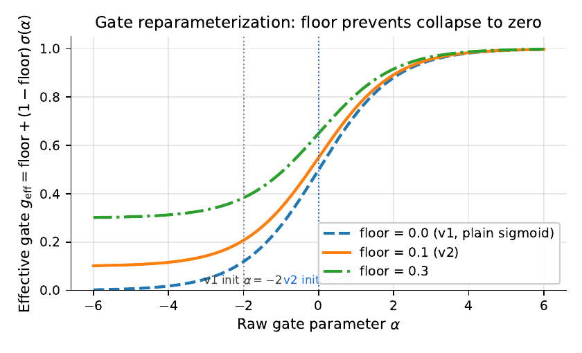
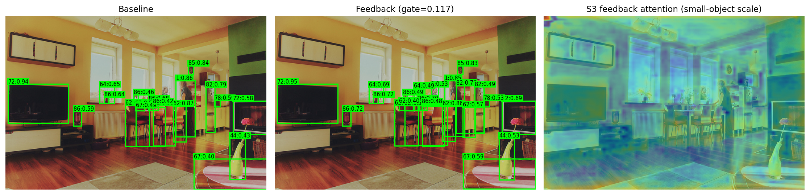
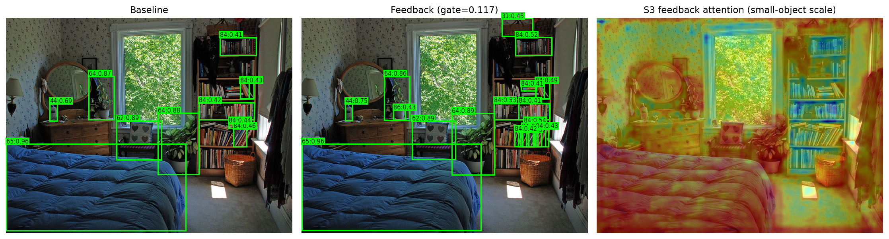
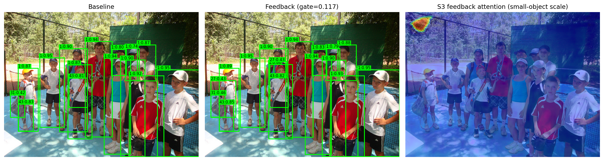
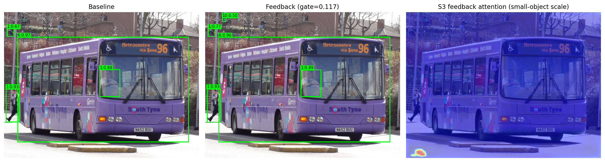

# Feedback-Augmented RT-DETR
### A Cross-Attention Refinement Strategy for Enhanced Small-Object Detection

*Computer Vision and Image Processing — Bocconi University*

> 📄 **[Read the full 16-page report (PDF) →](report/main.pdf)**

---

## TL;DR

**Problem.** RT-DETR achieves real-time detection without NMS, but its small-object
performance (AP\_S = 34.7 on COCO) lags behind larger-object scores. The encoder
memory is computed once and never refined, even though decoder layers continuously
extract more information about object hypotheses as they fire.

**What we add.** A *decoder-to-encoder feedback* module: after the first decoder
layer makes preliminary predictions, its query output is fed back as
keys/values in a cross-attention pass that refines the encoder memory.
Later decoder layers then attend over the refined memory.

**The catch we hit (v1, the negative result).** A naive implementation produced
the expected on-paper numbers, but a same-checkpoint inference ablation showed
**ΔAP\_S = 0.00** — the mechanism contributed nothing causally. The
sigmoid-parameterized gate had decayed to ≈ 0.12 during training, silencing
the cross-attention output before it reached memory.

**The fix (v2).** Two structural changes to the same module — both **zero new
parameters**:

1. **Gate-floor reparameterization** — `g_eff = floor + (1−floor)·σ(α)` with
   floor = 0.1. The optimizer can no longer push the gate to zero; it is
   structurally guaranteed to remain in the loop.
2. **Level mask** — restrict the cross-attention to the P2 (stride 4) and P3
   (stride 8) memory levels where small objects live. S4/S5 token positions
   pass through byte-identical.

**Result.**

| Metric | v1 ablation Δ | **v2 ablation Δ** |
|---|:-:|:-:|
| AP   | +0.09 | **+0.57** |
| **AP\_S** | **0.00** | **+0.99** |
| AP\_M | +0.10 | **+0.42** |
| AP\_L | +0.20 | **+0.50** |

v2 turns the silent mechanism into a measurable one, with the causal
contribution **largest on AP\_S** — exactly where the design hypothesis
predicted. At higher inference resolution (800 × 800) v2 reaches AP\_S = 37.01.

**Methodological takeaway.** When introducing a learnable additive component
to an already-trained pipeline, an unconstrained sigmoid gate gives the
optimizer an escape route to silence the new mechanism without paying a loss
penalty. A floor on the gate is a one-line structural fix that closes that
escape route — and in our setting, it is the difference between a positive
and a null causal-effect ablation.

---

## Project context

This repository extends [RT-DETR](https://github.com/lyuwenyu/RT-DETR) with the
decoder-to-encoder feedback module described above. It documents both
implementations end-to-end:

- **v1** — the negative-result baseline. All artifacts (code, configs, ablation
  JSONs, per-epoch trajectories, detection visualizations, training logs) are
  preserved in [`v1_results/`](v1_results/).
- **v2** — the positive result. Same artifacts in
  [`v2_results/`](v2_results/) plus a [`v2_results/README.md`](v2_results/README.md)
  with the headline numbers and exact code state.
- **report/** — 16-page LaTeX write-up covering math, the multiple approaches
  considered before settling on (gate floor + level mask), full ablation and
  per-epoch tables, gate dynamics, qualitative detections, the full
  `feedback_module.py` code listing in the appendix, and 15 references.

---

## Headline numbers

Same-checkpoint ablation on COCO val2017 @ 640 (only `feedback.disabled` toggled at inference):

| Mode | AP | **AP\_S** | AP\_M | AP\_L |
|---|---|---|---|---|
| v2 ON  | 52.10 | **34.25** | 56.33 | 68.82 |
| v2 OFF | 51.53 | 33.26 | 55.91 | 68.32 |
| **Δ (causal)** | **+0.57** | **+0.99** | **+0.42** | **+0.50** |



For reference, **v1**'s same ablation gave ΔAP\_S = 0.00 — the mechanism was
silent because the gate had decayed to ≈ 0.12 during training. v2 holds the
gate at ≈ 0.39 throughout training via the floor reparameterization. **Both
versions have identical parameter count (49.08 M); the v2 changes are
zero-parameter.**

At higher inference resolution (800 × 800):

| Resolution | AP | AP\_S | AP\_M | AP\_L |
|---|---|---|---|---|
| 640 | 52.10 | 34.25 | 56.33 | 68.82 |
| **800** | **52.31** | **37.01** | 56.35 | 67.04 |

### Per-epoch AP\_S — v1 vs v2



v2 (blue) crosses v1's eventual final number (33.91) at epoch 8, four epochs
before v1 reaches it. The chain-restart steps are visible as small dips at
epochs 0, 1, and the link boundaries.

### Gate dynamics



Starting at gₑff = 0.55 from α\_init = 0 and floor = 0.1, the v2 gate drifts
gradually downward to ≈ 0.39 by epoch 12 — well above the 0.1 floor. v1's
gate by this point of training was ≈ 0.12, **below** what we set as v2's
floor; the v1 ablation showed exactly this silence.

### Why the floor matters



The plain sigmoid gate (dashed, v1) has its tail at zero — the optimizer can
push α arbitrarily negative at no cost, which is what happened in v1. The
floor reparameterization (solid, v2) bounds the gate below at `floor`,
removing that escape route.

### Qualitative detections (v2 final)

<p align="center">
  
  
</p>
<p align="center">
  
  
</p>

---

## How to read the report

The full write-up lives at [`report/main.pdf`](report/main.pdf). Three ways to view it:

1. **GitHub viewer** — click the [`report/main.pdf`](report/main.pdf) link above; GitHub renders PDFs in-browser (16 pages).
2. **Direct download** — [right-click here to save](report/main.pdf).
3. **Local clone** —
   ```bash
   git clone https://github.com/HatemSaadallah/feedback-augmented-rtdetr.git
   xdg-open feedback-augmented-rtdetr/report/main.pdf   # or your PDF viewer
   ```

To rebuild the report from source (LaTeX install required):
```bash
cd report && make
```

---

## Limitations and future work

We are upfront about what this study does and does not establish.

### Limitations

1. **Training schedule: 13 epochs instead of the standard 72.**
   RT-DETR's published numbers are produced under the **6× COCO schedule
   (~72 epochs)** trained from scratch. Due to compute constraints (a single
   shared A100 MIG slice on the Bocconi `stud` partition, ~32 hours wall
   clock for 13 epochs), we **finetuned from the public
   `rtdetr_r50vd_6x_coco.pth` weights** for 13 effective epochs across four
   chained SLURM jobs. As a consequence:
   - Our absolute AP\_S (34.25 ON, 33.26 OFF) sits ~0.4 below the published
     RT-DETR-R50 baseline of 34.7. This is **not** a fair head-to-head on
     absolute AP\_S, and we don't claim a new state of the art.
   - Our claim is the **+0.99 causal contribution** of the feedback module
     under the same-checkpoint ablation, which is a within-run measurement
     and is therefore valid even on a shorter schedule.
   - A from-scratch 6× run, or a longer finetune, would likely lift both
     ON and OFF numbers and could change the magnitude of the gap.

2. **Single training seed.** All numbers are from one training run. A
   multi-seed sweep would tighten the confidence interval on ΔAP\_S and
   confirm whether +0.99 is reproducible vs. a lucky draw.

3. **No floor-vs-mask isolation.** v2 changes both the gate parameterization
   and the level mask simultaneously, so we cannot say from this experiment
   alone whether either change is sufficient on its own. A 2×2 ablation
   (with/without floor × with/without mask) would resolve this.

4. **Latency cost is dominated by P2, not feedback.** The ~2× slowdown
   relative to RT-DETR baseline (53.3 → 25.9 FPS) is essentially entirely
   from adding the stride-4 feature level. The feedback module itself,
   especially with the level mask, is a small fraction of inference cost.

5. **No cross-dataset evaluation.** Results are on COCO val2017 only.
   Datasets where small objects dominate (aerial imagery like xView or
   DOTA, traffic surveillance) might show a larger or smaller gain.

### Future work

In rough order of how much they would extend the contribution:

- **Run the full 6× schedule from scratch.** Confirm whether the +0.99
  ΔAP\_S persists when both ON and OFF networks are properly trained for
  72 epochs, and quantify the gap on a fair absolute-AP comparison.
- **Multi-seed reproducibility study.** 3–5 seeds, report mean ± std on
  ΔAP\_S.
- **2×2 ablation: floor × mask.** Isolate the contribution of each of the
  two structural changes.
- **Feedback without P2.** Test whether the +0.99 gain transfers to the
  original 3-level (P3–P5) configuration, which would recover the baseline
  53 FPS while keeping the small-object gain.
- **Cross-dataset evaluation.** Run on aerial / surveillance datasets where
  small-object density is the binding constraint.
- **Compose with query-side refinement.** Decoder-to-encoder feedback is
  orthogonal to query-side iterative refinement (deformable cross-attention,
  DAB-style anchor updates). The two could be combined.
- **Multiple feedback passes.** We refine memory only once, after decoder
  layer 0. Refining again after layer 2 (or feeding back at every layer)
  is a natural extension.

---

## What changed (v1 → v2)

Three structural changes to `src/zoo/rtdetr/feedback_module.py`. **No new
parameters**; only reparameterization plus a compute-time level mask.

```python
# 1. Gate init bumped: sigmoid(-2.0)=0.12  →  sigmoid(0.0)=0.50
gate_init: -2.0  →  0.0

# 2. Gate floor reparameterization (NEW): gate cannot collapse below floor.
#    Before:  g_eff = sigmoid(alpha)
#    After:   g_eff = floor + (1 - floor) * sigmoid(alpha)
gate_floor: 0.1

# 3. Level mask (NEW): refine only P2/P3 features (where small objects live).
#    Cross-attention computed on memory subset; S4/S5 token positions
#    in the refined memory are byte-identical to the input.
level_mask: [True, True, False, False]  # (P2, P3, P4, P5)
```

Plus one bug fix discovered during training:
```python
# AMP fp16 vs LayerNorm fp32 dtype mismatch in the new index_copy_ path
out.index_copy_(1, active_idx, h.to(memory.dtype))
```

The full v2 module is at
[`rtdetr_pytorch/src/zoo/rtdetr/feedback_module.py`](rtdetr_pytorch/src/zoo/rtdetr/feedback_module.py)
(also mirrored in `v2_results/code/` for reproducibility).

---

## Repository layout

```
.
├── report/                         16-page LaTeX report (main.pdf is the deliverable)
│   ├── main.pdf                    ← final report
│   ├── main.tex
│   ├── sections/                   one .tex per section
│   ├── figures/                    plots + detection visualizations
│   ├── bibliography.bib
│   ├── Makefile                    `make` rebuilds main.pdf
│   └── scripts/generate_figures.py recreates plots from the JSON logs
│
├── v2_results/                     final v2 artifacts (positive result)
│   ├── ablations/                  3 ablation JSONs (ON 640, OFF 640, ON 800)
│   ├── logs/                       per-epoch log.txt + chain SLURM stdout
│   ├── code/                       exact code state at training time
│   └── README.md                   v2-specific notes
│
├── v1_results/                     v1 artifacts (negative-result baseline)
│   ├── ablations/                  4 v1 ablation JSONs
│   ├── logs/                       v1 per-epoch log.txt + chain stdout
│   ├── viz/                        5 detection visualizations
│   └── feedback_module.py          v1 module source for v1 vs v2 diff
│
├── rtdetr_pytorch/                 RT-DETR PyTorch source (modified)
│   ├── src/zoo/rtdetr/
│   │   ├── feedback_module.py      ← novel contribution (v2)
│   │   └── rtdetr_decoder.py       (kwargs threaded for feedback)
│   ├── configs/rtdetr/
│   │   └── rtdetr_r50vd_hpc_feedback_p2_v2.yml
│   └── tools/
│       ├── full_ablation.py        ON-vs-OFF ablation eval
│       ├── smoke_test_feedback.py  6 invariants for the feedback module
│       └── visualize_feedback.py
│
├── check_status.sh                 live HPC dashboard (Bocconi-internal use)
├── README_upstream.md              the original RT-DETR README (preserved)
└── README.md                       you are here
```

The trained checkpoints (`*.pth`, ~750 MB each) are excluded from git per
GitHub's 100 MB file-size limit. They live under
`v1_results/checkpoints/` and `v2_results/checkpoints/` on the author's local
machine; reach out if you need them.

---

## Reproducing the headline ablation

Given the v2 checkpoint locally, the +0.99 ΔAP\_S is reproduced by two calls
to `tools/full_ablation.py` against the same checkpoint:

```bash
cd rtdetr_pytorch

# feedback ON (default)
python tools/full_ablation.py \
    -c configs/rtdetr/rtdetr_r50vd_hpc_feedback_p2_v2.yml \
    -r path/to/checkpoint_v2_final.pth \
    --label v2_on_640 --out-json /tmp/ablation_on.json

# feedback OFF (same checkpoint, only inference toggled)
python tools/full_ablation.py \
    -c configs/rtdetr/rtdetr_r50vd_hpc_feedback_p2_v2.yml \
    -r path/to/checkpoint_v2_final.pth --feedback-off \
    --label v2_off_640 --out-json /tmp/ablation_off.json

# delta
python -c "
import json
on  = json.load(open('/tmp/ablation_on.json'))
off = json.load(open('/tmp/ablation_off.json'))
print(f'AP_S(ON) = {on[\"AP_S\"]*100:.2f}')
print(f'AP_S(OFF) = {off[\"AP_S\"]*100:.2f}')
print(f'Delta AP_S = {(on[\"AP_S\"]-off[\"AP_S\"])*100:+.2f}')
"
# expected output:
#   AP_S(ON) = 34.25
#   AP_S(OFF) = 33.26
#   Delta AP_S = +0.99
```

Pre-computed JSONs are in `v2_results/ablations/`.

---

## Training (for completeness)

The v2 checkpoint was produced by 13 effective epochs of finetuning from the
public `rtdetr_r50vd_6x_coco.pth` weights, on COCO `train2017` with
multi-scale [480..800], using AdamW with per-group learning rates (backbone
5e-7, all other groups 5e-5). Run as four chained SLURM jobs on a Bocconi
A100 80 GB (4g.40gb MIG slice), ~32 hours wall-clock.

The exact training script: `rtdetr_pytorch/scripts_hpc/train_p2_v2_chain.sbatch`.

---

## Rebuilding the report

The 16-page LaTeX report is in `report/`:

```bash
cd report
make           # regenerates figures + 3-pass pdflatex + bibtex
xdg-open main.pdf
```

Requires a working LaTeX install. The `Makefile` is configured for
`~/.TinyTeX/bin/x86_64-linux/pdflatex`; adjust `PDFLATEX` and `BIBTEX` paths
if your install is elsewhere. Figures are regenerated by
`scripts/generate_figures.py` from the JSONs and `log.txt` files in
`v1_results/` and `v2_results/`.

---

## Sources and inspirations

### Codebase

- **[RT-DETR (lyuwenyu/RT-DETR)](https://github.com/lyuwenyu/RT-DETR)** — the
  upstream codebase this work extends. We reuse the hybrid encoder
  (AIFI + CCFF), the MS-deformable decoder, and the contrastive-denoising
  training group. The feedback module is added as a new `nn.Module` in
  `src/zoo/rtdetr/feedback_module.py` and wired into the existing
  `RTDETRTransformer` via two new `__init__` kwargs. Original upstream README
  preserved as [`README_upstream.md`](README_upstream.md).

### Primary technical references

The full bibliography (15 entries) is in
[`report/bibliography.bib`](report/bibliography.bib). The most load-bearing:

| | Reference | What we use it for |
|---|---|---|
| **Backbone architecture** | Lyu et al., *DETRs Beat YOLOs on Real-time Object Detection*, CVPR 2024 — [arXiv:2304.08069](https://arxiv.org/abs/2304.08069) | RT-DETR-R50 baseline; AIFI + CCFF hybrid encoder; deformable decoder |
| **End-to-end set prediction** | Carion et al., *End-to-End Object Detection with Transformers*, ECCV 2020 — [arXiv:2005.12872](https://arxiv.org/abs/2005.12872) | NMS-free Hungarian-matching framework |
| **Deformable attention math** | Zhu et al., *Deformable DETR*, ICLR 2021 — [arXiv:2010.04159](https://arxiv.org/abs/2010.04159) | The MS-deformable attention used by every decoder layer (Eq. 2 in the report) |
| **Anchor-style queries** | Liu et al., *DAB-DETR*, ICLR 2022 — [arXiv:2201.12329](https://arxiv.org/abs/2201.12329) | Reference-point initialization in the decoder |
| **Denoising training** | Zhang et al., *DINO: DETR with Improved DeNoising Anchor Boxes*, ICLR 2023 — [arXiv:2203.03605](https://arxiv.org/abs/2203.03605) | Contrastive-denoising auxiliary queries during training (and the reason we slice them off before feedback runs) |
| **Small-object motivation** | Lin et al., *Feature Pyramid Networks for Object Detection*, CVPR 2017 — [arXiv:1612.03144](https://arxiv.org/abs/1612.03144) | Why we add the stride-4 P2 level; why the level mask targets P2/P3 |
| **Dataset and metrics** | Lin et al., *Microsoft COCO*, ECCV 2014 — [arXiv:1405.0312](https://arxiv.org/abs/1405.0312) | val2017 evaluation; AP\_S/M/L definitions |
| **Optimizer** | Loshchilov & Hutter, *Decoupled Weight Decay Regularization*, ICLR 2019 — [arXiv:1711.05101](https://arxiv.org/abs/1711.05101) | AdamW with our 4-group LR schedule |
| **Mixed precision** | Micikevicius et al., *Mixed Precision Training*, ICLR 2018 — [arXiv:1710.03740](https://arxiv.org/abs/1710.03740) | AMP fp16 (the source of the dtype bug we fixed in `index_copy_`) |
| **Backbone weights** | He et al., *Deep Residual Learning*, CVPR 2016 — [arXiv:1512.03385](https://arxiv.org/abs/1512.03385) | ResNet-50-vd backbone |

### Design inspirations

- **Gate-floor reparameterization.** The shape of the gate function is
  reminiscent of the bias term in **Highway Networks** (Srivastava, Greff,
  Schmidhuber, 2015 — [arXiv:1505.00387](https://arxiv.org/abs/1505.00387)),
  which similarly biases a residual gate to keep gradient flow alive. Our
  use is different (preventing optimizer-driven silencing of an additive
  module) but the structural intuition is the same: **modify the gate's
  parameterization, not just its initialization**.
- **Iterative refinement of detection state.** Refining model state across
  layers in a detector is a well-established idea — **Cascade R-CNN**
  (Cai & Vasconcelos, 2018 —
  [arXiv:1712.00726](https://arxiv.org/abs/1712.00726)) refines bounding
  boxes across IoU thresholds; **Deformable DETR** and **DAB-DETR** refine
  query reference points across decoder layers. What we add is iterative
  refinement of the **encoder memory** based on early decoder predictions —
  the dual direction to query-side refinement.
- **Cross-attention as a refinement primitive.** The general pattern of
  using cross-attention to inject information from one stream into another,
  controlled by a learnable gate, is borrowed from a long line of
  transformer literature. Our specific choice — refining `key=value=memory`
  by `query=decoder_predictions` — is to our knowledge a less common
  direction than the more standard `query=memory, key/value=decoder`.

### Course context

Final project for **Computer Vision and Image Processing** (Bocconi
University, MSc in Artificial Intelligence). The original project pitch
slides ("Feedback-Augmented RT-DETR: A Cross-Attention Refinement Strategy
for Enhanced Object Detection", March 26, 2025) framed the problem; this
repository is the post-implementation deliverable.

## Acknowledgments

- Trained on the **Bocconi University HPC cluster** (`stud` partition, A100
  80 GB MIG slice). The chained SLURM training scripts are in
  [`v2_results/code/train_p2_v2_chain.sbatch`](v2_results/code/train_p2_v2_chain.sbatch)
  and the per-link logs are in [`v2_results/logs/`](v2_results/logs/).
- Pitch co-authorship and progress feedback from **Nour Jennane**.

## Authors

- **Hatem Saadallah** — Bocconi University, MSc in Artificial Intelligence
- **Nour Jennane** — Bocconi University, MSc in Artificial Intelligence

## License

Code modifications follow the upstream RT-DETR license (Apache-2.0).
The report and figures are released under CC-BY-4.0.
